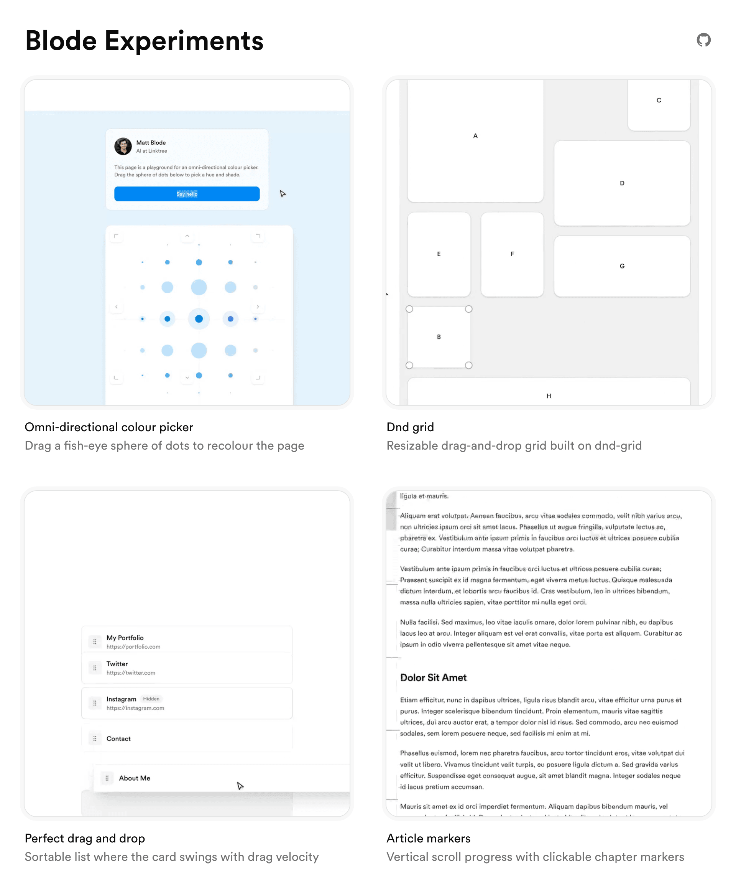

# [Experiments](https://blode.co/experiments)

**Standalone UI and motion experiments: interactions, 3D scenes, and components built to a finish**

Every experiment on one index page, each card a looping clip of the thing itself.
Open any one and play with it, then read what is actually interesting in how it works.

  

  

## License

MIT

---

Crafted by  [Matthew Blode](https://blode.co)
